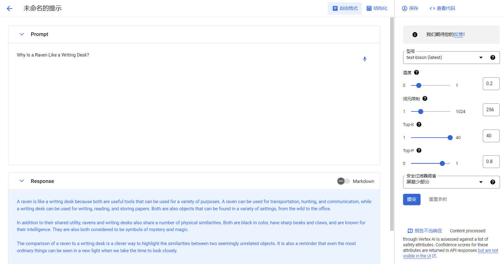
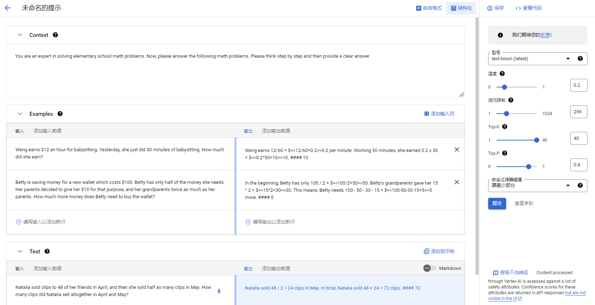

Bard在线调用网址：<https://bard.google.com/?hl=en>

谷歌云Vertex AI API在线试用（需要先建立一个项目）：https://console.cloud.google.com/vertex-ai/generative/language/create/text?project=project_id

自由问答：

上下文学习：

[Python调用谷歌云Vertex AI API](vertextai_api_predict.py)：主要问题在于我试了几遍都无法访问谷歌的IP地址，所以我放弃了