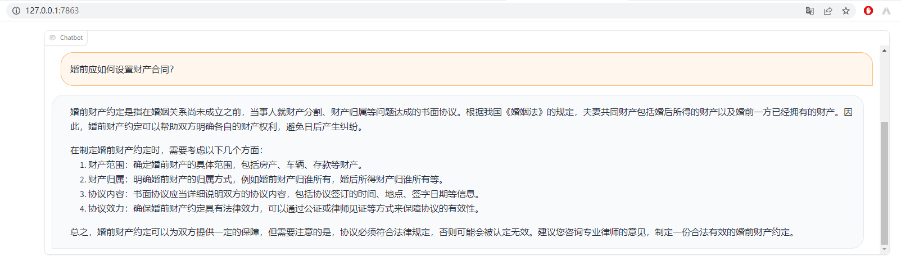

在线版试用我之前申请成功了，但是现在关了。

本地模型部署：
下载和运行方式见：[lawyer-llama/demo/run_inference.md at main · AndrewZhe/lawyer-llama · GitHub](https://github.com/AndrewZhe/lawyer-llama/blob/main/demo/run_inference.md)

其中LLaMA原始权重需要非HF格式，我看了一下社区上的这个大概就跟原权重一样：<https://huggingface.co/nyanko7/LLaMA-7B/tree/main>（我自己用的是别人给的磁力链接下载的）

web端的使用效果：